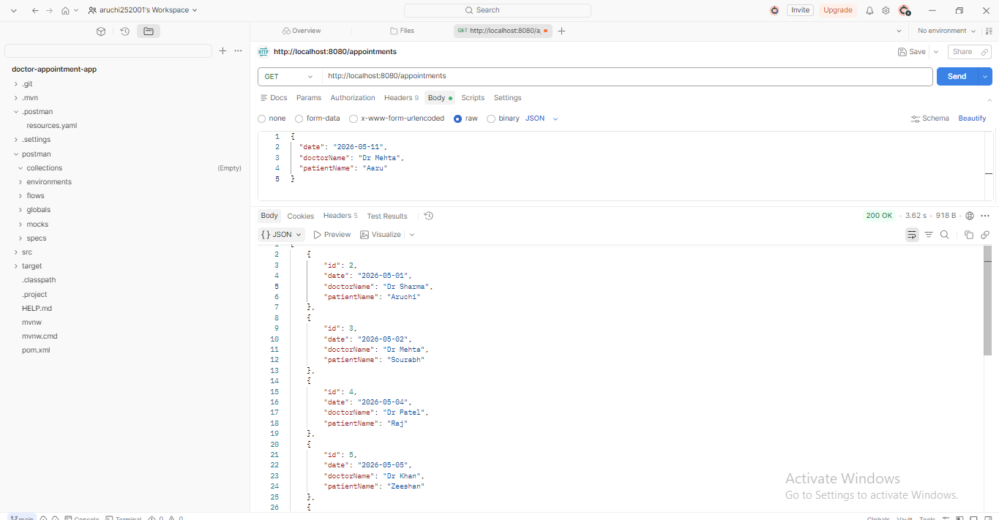
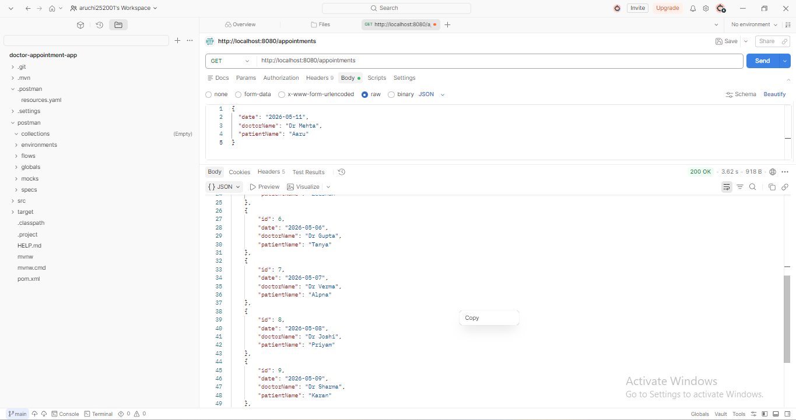
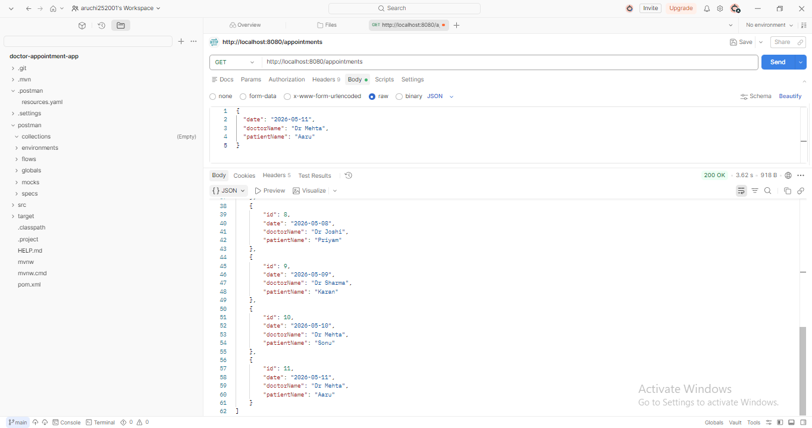
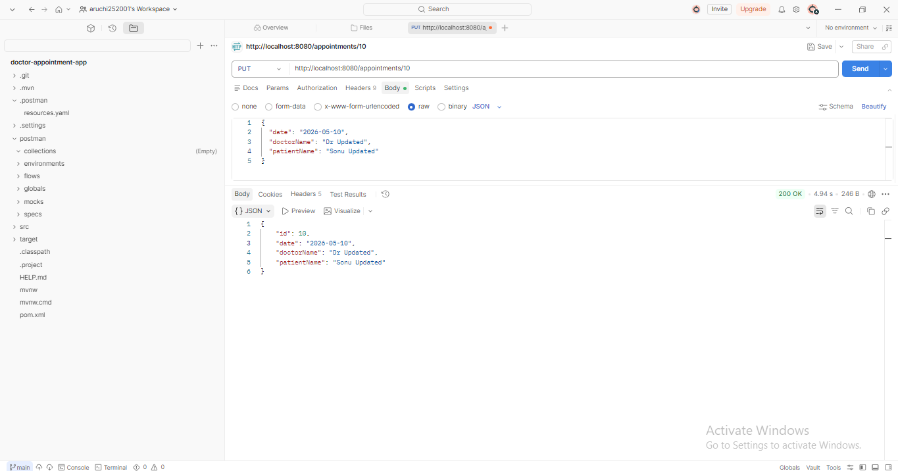
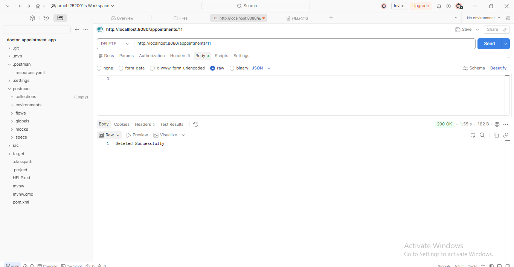
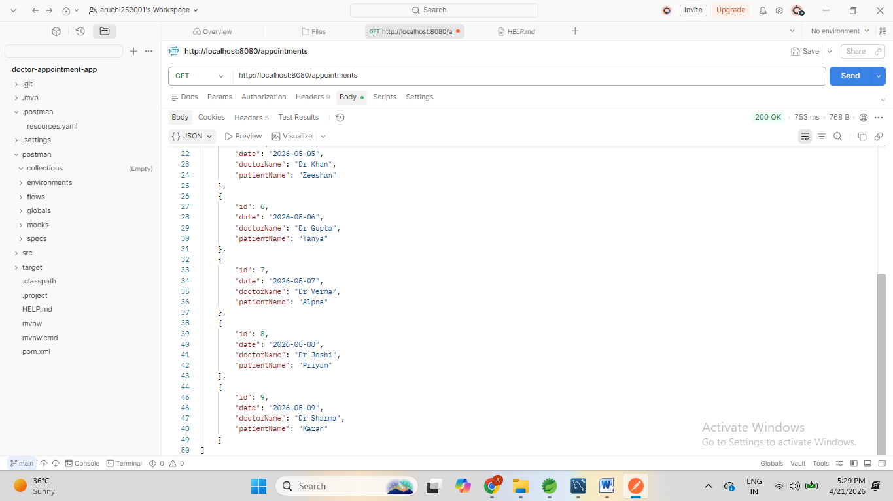
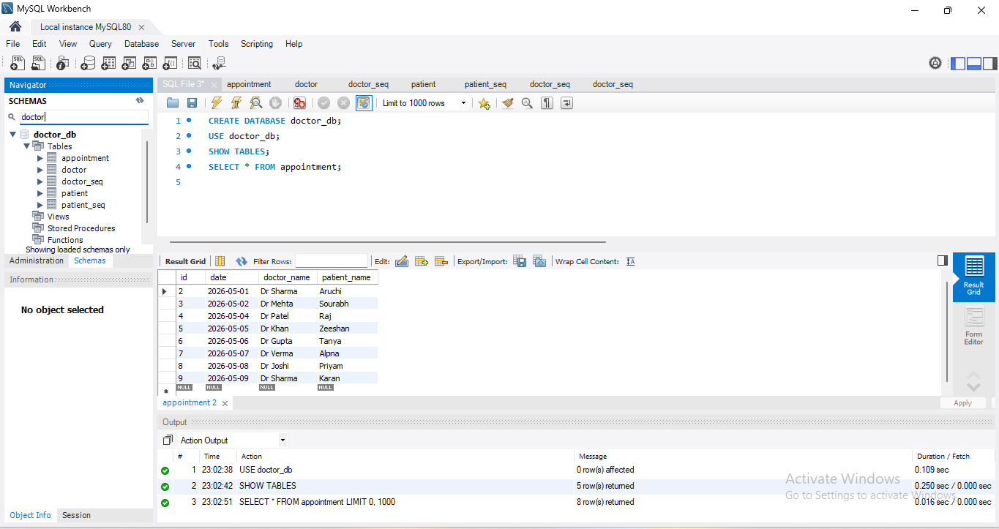

# Doctor Appointment System

## Description
This is a Spring Boot project for managing doctor appointments.

## Features
- Add Appointment
- View Appointment
- Update Appointment
- Delete Appointment

## Technologies
- Java
- Spring Boot
- MySQL
- Postman

## Author
Aruchi Karankar

## 📸 Screenshots

### GET All Records (Part 1)

### GET All Records (Part 2)

### GET All Records (Part 3)

### Update Request (PUT)

### Updated Records (After PUT)

### Delete Record

### Final Output

### Database Output (MySQL)

