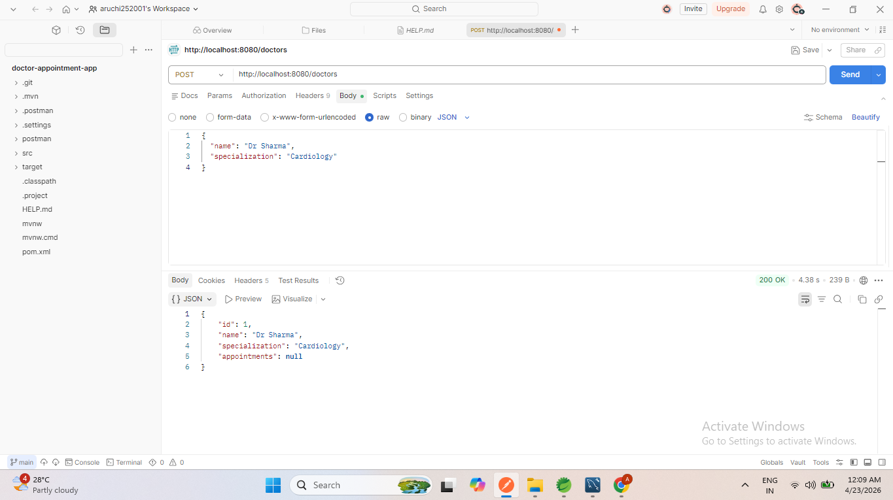
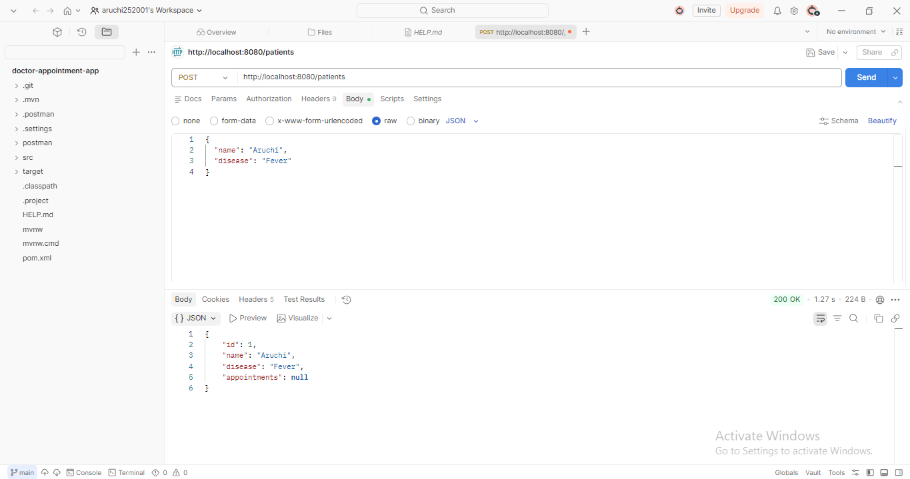
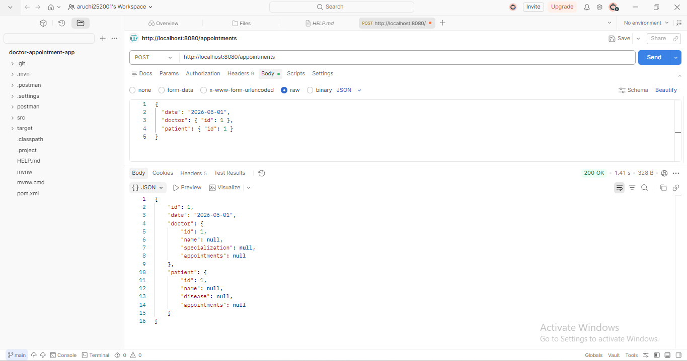
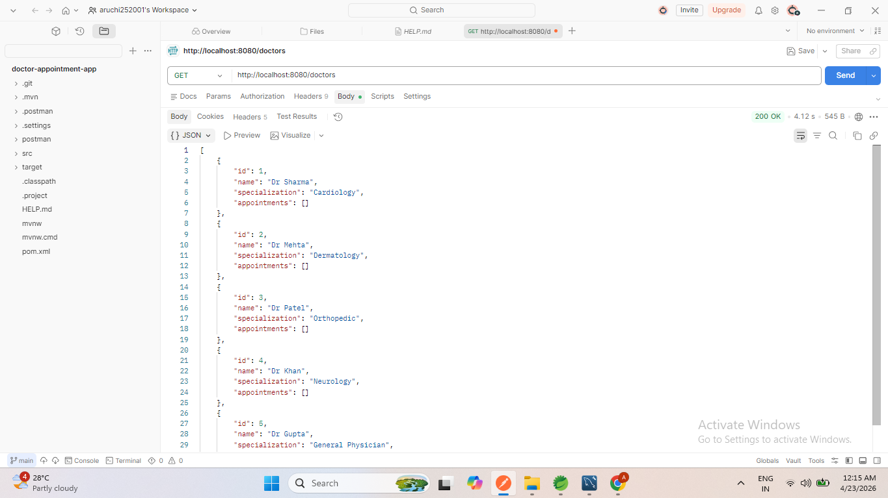
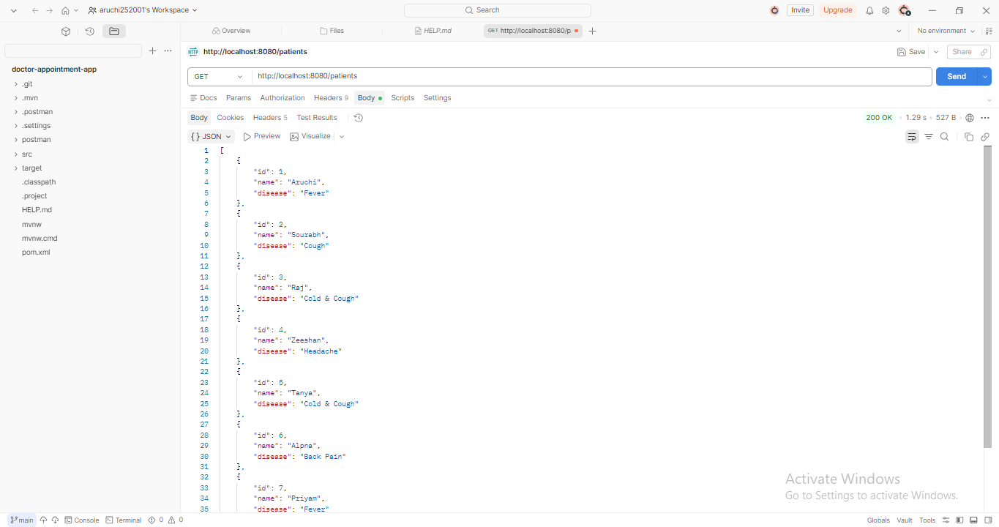
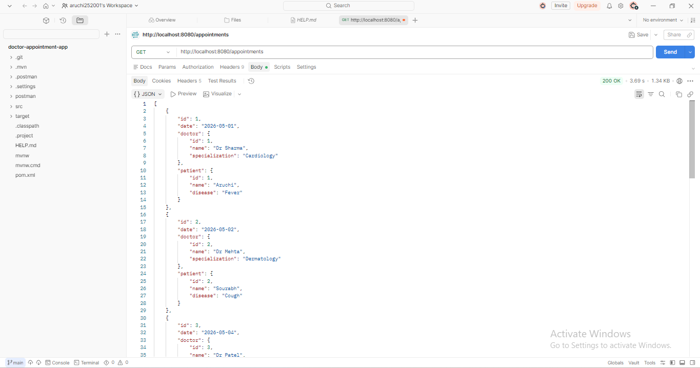
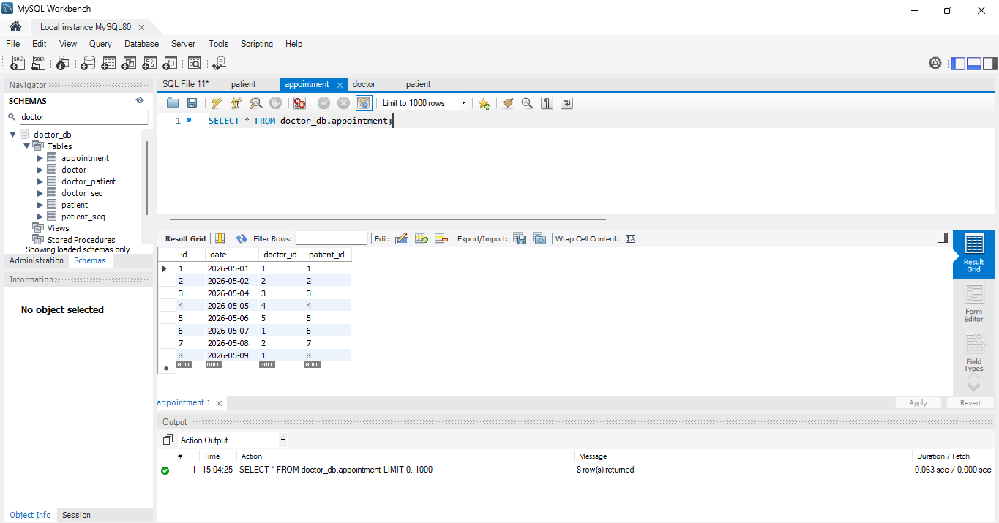

🏥 Doctor Appointment System  

📌 Description  
This is a Spring Boot based REST API project for managing doctor appointments.  
It provides CRUD operations to create, view, update, and delete records, and manages relationships between Doctor, Patient, and Appointment using MySQL database.  

---

🚀 Features  
➕ Create Doctor, Patient, Appointment  
📄 View All Records  
✏️ Update Appointment  
❌ Delete Appointment  
🔗 Manage relationships (Doctor ↔ Patient via Appointment)  

---

🛠️ Technologies Used  
- Java  
- Spring Boot  
- Spring Data JPA  
- MySQL  
- Postman  

---

👩‍💻 Author  
Aruchi Karankar  

---

## 📸 API Screenshots  

### 🔹 Relationship APIs  

**Create Doctor**  

**Create Patient**  

**Create Appointment**  

**Get All Doctors**  

**Get All Patients**  

**Get All Appointments**  

**Database Output**  

---

### 🔹 CRUD Operations  

**Get All Appointments**  

**Update Appointment**  

**Delete Appointment**  

**Database Table**  

---

## 💡 Key Learnings  
- Built REST APIs using Spring Boot  
- Implemented entity relationships using JPA  
- Performed CRUD operations  
- Tested APIs using Postman  
- Integrated MySQL database  

---

## ✅ Conclusion  
This project demonstrates backend development using Spring Boot with proper CRUD operations and relationship mapping between entities.
