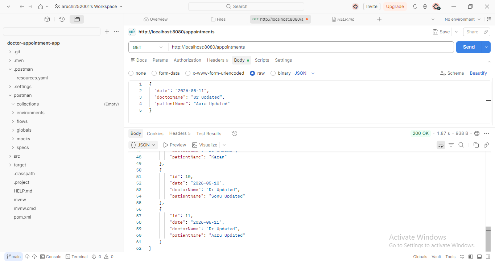

# Doctor Appointment System

# 🏥 Doctor Appointment System

## 📌 Description

This is a Spring Boot based backend project for managing doctor appointments.
It performs CRUD operations using REST APIs and stores data in MySQL database.

---

## 🚀 Features

* ➕ Add Appointment
* 📄 View All Appointments
* ✏️ Update Appointment
* ❌ Delete Appointment

---

## 🛠️ Technologies Used

* Java
* Spring Boot
* MySQL
* Postman

---

## 👩‍💻 Author

Aruchi Karankar

---

## 📸 Screenshots

### GET All Records (Part 1)

### GET All Records (Part 2)

### GET All Records (Part 3)

### Update Request (PUT)

### Updated Records (After PUT)

### Delete Record

### Final Output

### Database Output (MySQL)

---

## ✅ Conclusion

This project demonstrates how to build REST APIs using Spring Boot and perform CRUD operations with database integration.

---
